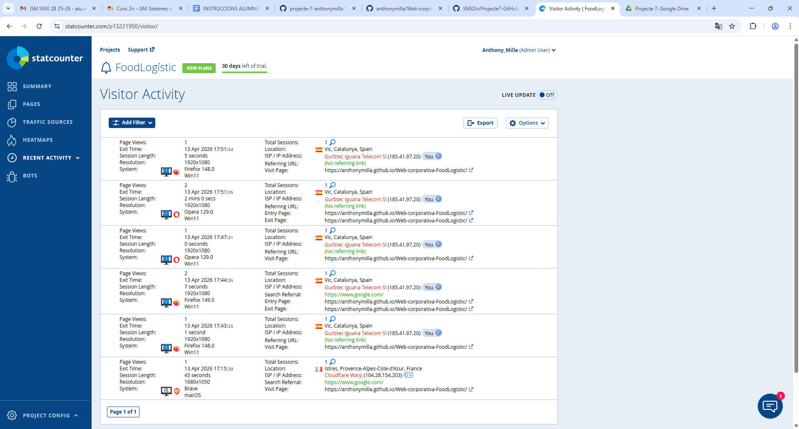

# Web Corporativa de FoodLogistic

Aquesta és la web corporativa de FoodLogistic, una empresa fictícia dedicada a la distribució de productes alimentaris dins el mòdul *Projecte Intermodular*.

## Demostració

[🌐 URL de la web](https://anthonymilla.github.io/Web-corporativa-FoodLogistic/)

## Informació de Statcounter

## Tecnologies Utilitzades

Per la creació d'aquesta web, s'han utilitzat les següents tecnologies i eines:

- Copilot
- HTML5/CSS3
- Statcounter per l'analítica
- [Anar a veure codi de la web](../docs/index.html)    
[Anar a la Guia](../Tasca02/Guia.md)       

## Autor

👤 Anthony Milla
